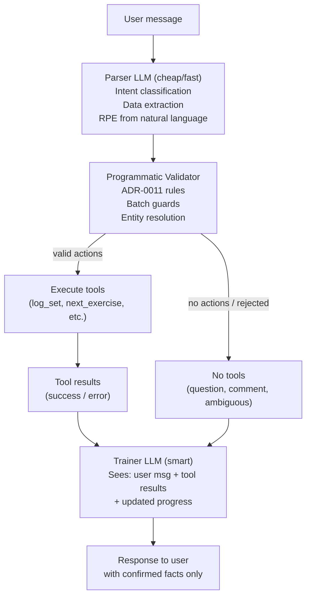

# Dual LLM Training Architecture (ADR-0012)

> **Status: Plan B.** The primary approach is dynamic tools + prompt hardening (simpler, faster to implement). If phantom sets and dialogue issues persist after testing, this architecture becomes the next step.

## Problem

The current monolithic training LLM mixes dialogue and tool execution in a single call, causing:

- BUG-008: phantom sets logged when user asks questions or comments
- BUG-006: `finish_training` called as fallback after tool errors
- Dialogue ignored in favor of tool calls
- Prompt rules violated despite being explicitly stated

## Plan A — Dynamic Tools + Prompt Hardening

Before implementing the full dual-LLM architecture, try a simpler approach:

1. **Dynamic tool availability** — filter tools based on session state before each LLM invoke:
   - No `in_progress` exercise → `log_set` unavailable
   - 0 sets logged → `delete_last_sets`, `update_last_set` unavailable
   - `finish_training` remains always available (user can end session anytime)
2. **Prompt hardening** — rewrite rules to prioritize dialogue over tool calls (RULE 0, rewrite Rule 5, harden Rule 8, add anti-patterns)
3. **Test on real training session** — if phantom sets still appear, proceed to Plan B

## Plan B — Dual LLM Architecture

## Architecture



Key principle: **Parser has tools but no voice. Trainer has voice but no tools.**

## Parser LLM

**Model:** Cheap/fast (Haiku, GPT-4o-mini, or similar)
**Input context (~500-800 tokens):**

```typescript
interface ParserInput {
  userMessage: string;
  currentExercise: { id: number; name: string; lastSet: SetData | null } | null;
  sessionProgress: Array<{
    exerciseId: number;
    exerciseName: string;
    status: 'pending' | 'in_progress' | 'completed' | 'skipped';
    setsLogged: number;
    lastSet: { reps?: number; weight?: number; rpe?: number } | null;
  }>;
  lastAction: { tool: string; result: string } | null;
}
```

**Output (structured):**

```typescript
interface ParserOutput {
  intent: 'set_data' | 'correction' | 'navigation' | 'question' | 'comment' | 'finish' | 'mixed';
  actions: Array<{
    tool: 'log_set' | 'update_last_set' | 'delete_last_sets' | 'next_exercise' | 'skip_exercise' | 'finish_training';
    exerciseId?: number;
    reps?: number;
    weight?: number;
    weightDelta?: number;        // "+10" / "-5" — resolved by validator
    rpe?: number;                // extracted from natural language
    feedback?: string;           // pain, form issues, partial reps
    count?: number;              // for delete_last_sets
    order?: number;              // for multiple log_set
    refersPreviousSet?: boolean; // "same weight", "same again"
  }>;
  confidence: 'high' | 'medium' | 'low';
  ambiguityNote?: string;       // when confidence is low
}
```

**Parser prompt responsibilities:**

- Classify intent: is this set data, a question, a comment, a correction, a navigation request?
- Extract explicit numbers (reps, weight, duration)
- Resolve relative references ("added 10kg" → `weightDelta: +10`, "same weight" → `refersPreviousSet: true`)
- Map exercise mentions to exerciseId from session progress ("bench" → Bench Press ID:1)
- Extract RPE from natural language ("heavy" → 8, "max effort" → 10, "easy" → 5)
- Extract feedback signals ("shoulder pain", "form broke down", "+3 partials")
- Return `actions: []` for questions, comments, feelings without set data
- If a feeling/RPE comment follows a just-logged set → `update_last_set(rpe: X)`

**Parser prompt anti-patterns (explicit):**

```
NEVER invent data not in the user's message.
NEVER fill in missing reps or weight from session progress.
"same weight" is NOT inventing — it is a reference the validator will resolve.
"easy" → RPE 5 is extraction, not invention.
"did a set" without numbers → actions: [], missing_data: true
```

## Programmatic Validator

Located in [`training.subgraph.ts`](apps/server/src/infra/ai/graph/subgraphs/training.subgraph.ts). Runs between parser output and tool execution. Deterministic, not LLM-based.

**Responsibilities:**

- Resolve `weightDelta` → absolute weight using session progress
- Resolve `refersPreviousSet` → copy reps/weight from last set
- Resolve `exerciseId` if parser used exercise name matching
- ADR-0011: sort by priority, deduplicate log_set calls
- Guard: `finish_training` only allowed as sole action, not in batch
- Guard: `log_set` + `skip_exercise` for same exercise → reject `log_set`
- Guard: `delete_last_sets` + `log_set` for same exercise → convert to `update_last_set`
- Guard: if `confidence: 'low'` → reject all actions, pass ambiguity note to trainer
- Validate: reps > 0, weight > 0, RPE 1-10

## Trainer LLM

**Model:** Smart (Sonnet, GPT-4o, or current model)
**Input context:** Same as current training prompt, BUT:

- No tool definitions (trainer cannot call tools)
- Added: tool execution results (success/error for each action)
- Added: `parser_extracted_no_actions` flag when parser found nothing
- Added: `ambiguityNote` from parser when confidence was low
- Removed: Critical Rules about tool calling (moved to parser/validator)

**Trainer prompt focus:**

- You are a personal trainer guiding the client
- Your ONLY job is dialogue: acknowledge, recommend, motivate, warn
- Tool results tell you what was recorded — report them faithfully
- If `parser_extracted_no_actions` and the message looks like set data → ask user to clarify
- If `ambiguityNote` present → address the ambiguity naturally
- Never say "recorded" / "logged" unless tool results confirm it

## Files to change

### New files

- `apps/server/src/infra/ai/graph/nodes/training-parser.node.ts` — parser system prompt
- `apps/server/src/infra/ai/graph/nodes/training-validator.ts` — programmatic validator

### Modified files

- [`training.subgraph.ts`](apps/server/src/infra/ai/graph/subgraphs/training.subgraph.ts) — replace single agent loop with: parser → validator → tools → trainer
- [`training.node.ts`](apps/server/src/infra/ai/graph/nodes/training.node.ts) — remove tool-related rules, refocus on dialogue
- [`training.tools.ts`](apps/server/src/infra/ai/graph/tools/training.tools.ts) — tools remain unchanged, called by validator not LLM
- [`model.factory.ts`](apps/server/src/infra/ai/model.factory.ts) — add cheap model config for parser

### Unchanged

- All other phases (chat, registration, plan_creation, session_planning) — keep current architecture
- Tool implementations — no changes to business logic
- Database layer — no changes

## Edge cases and mitigations

- **Relative references** ("added 10kg", "same weight") → resolved by validator using session progress
- **Exercise entity resolution** ("bench", "pulldown") → parser matches against session progress exercise names
- **RPE from natural language** ("heavy" → 8, "max effort" → 10) → parser extraction with mapping table
- **Feedback extraction** ("shoulder pain", "form broke") → parser extracts as feedback field
- **Post-set RPE comment** ("was heavy") → parser sees `lastAction` was log_set → returns `update_last_set(rpe: X)`
- **Set on completed exercise** ("one more bench set") → parser resolves to correct exerciseId, validator allows log_set to completed exercise
- **Ambiguous message** ("10") → parser returns `confidence: 'low'` → validator rejects → trainer asks
- **Parser miss** (set data not recognized) → trainer sees `parser_extracted_no_actions` flag → asks user to clarify
- **Tool error** → mapped to human-readable before passing to trainer

## Bugs resolved by this architecture

- **BUG-008**: Parser cannot fabricate sets — it only extracts from explicit message content. Validator rejects suspicious patterns.
- **BUG-006**: `finish_training` only allowed as sole action + validator can require confirmation state.
- **BUG-001** (partially): Trainer always produces dialogue — it has no tools to call silently.

## Implementation order

1. Write ADR-0012 documenting the decision
2. Create parser prompt + structured output schema
3. Create validator with all guards
4. Restructure training subgraph: parser → validator → tools → trainer
5. Refactor trainer prompt (remove tool rules, add tool results format)
6. Add cheap model to model factory
7. Integration tests with real scenarios from BUG-008
8. Manual test with edge cases
