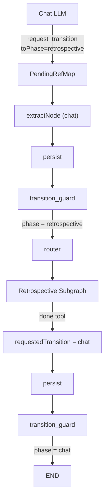

# Retrospective Subgraph — Implementation Plan

## Goal

After a training session ends, the user may say "I forgot to log planks" — the bot should add the data to the last session naturally, without the user noticing any mode switch.

## Architecture

## Files to create / modify

### 1. New: `retrospective.subgraph.ts`

Following [`chat.subgraph.ts`](apps/server/src/infra/ai/graph/subgraphs/chat.subgraph.ts):

- Subgraph state: `MessagesAnnotation` + `userId`, `user`, `userMessage`, `responseMessage`, `requestedTransition`
- Nodes: `agent` → `tools` (conditional) → `extract`
- Tools: `log_retro_set`, `done` (from `retrospective.tools.ts`)
- Fetches last completed session from DB by `userId`

### 2. New: `retrospective.tools.ts`

Two tools:

- `log_retro_set(exercise_name, reps, weight?, sets?, rpe?, feedback?)` — finds last completed session, adds record via `ITrainingService.logSetToLastSession`
- `done` — sets `requestedTransition = { toPhase: 'chat' }` and ends the subgraph

### 3. New: `retrospective.node.ts`

System prompt:
- Role: log exercises performed but not recorded during training
- Ask for missing data (exercise? weight? reps?)
- Call `done` when everything is recorded

### 4. [`conversation.graph.ts`](apps/server/src/infra/ai/graph/conversation.graph.ts)

- Add `retrospective` to `ConversationPhase`
- Add transitions: `chat → retrospective`, `retrospective → chat`
- Register `buildRetrospectiveSubgraph` as a node

### 5. [`chat.tools.ts`](apps/server/src/infra/ai/graph/tools/chat.tools.ts)

- Add `'retrospective'` to the `toPhase` union in `request_transition`

### 6. [`chat.node.ts`](apps/server/src/infra/ai/graph/nodes/chat.node.ts)

- Add rule: if user says they forgot to log an exercise from a past session → call `request_transition({ toPhase: 'retrospective' })`

### 7. [`service.ports.ts`](apps/server/src/domain/training/ports/service.ports.ts)

- Add `logSetToLastSession(userId, opts)` to `ITrainingService`

### 8. [`training.service.ts`](apps/server/src/domain/training/services/training.service.ts)

- Implement `logSetToLastSession`:
  - Find last completed session for user
  - Find or create `session_exercise` by exercise name
  - Log set via existing `logSet`

## Implementation order (TDD)

1. `logSetToLastSession` in service + test
2. `retrospective.tools.ts` + tool tests
3. `retrospective.node.ts` (system prompt)
4. `retrospective.subgraph.ts`
5. Wire into `conversation.graph.ts`
6. Update `chat.tools.ts` and `chat.node.ts`

## Out of scope

- Editing or deleting records via retrospective (add only)
- Retrospective for sessions older than the last one
- Modifying sets already logged during training (use `update_last_set` for that)
