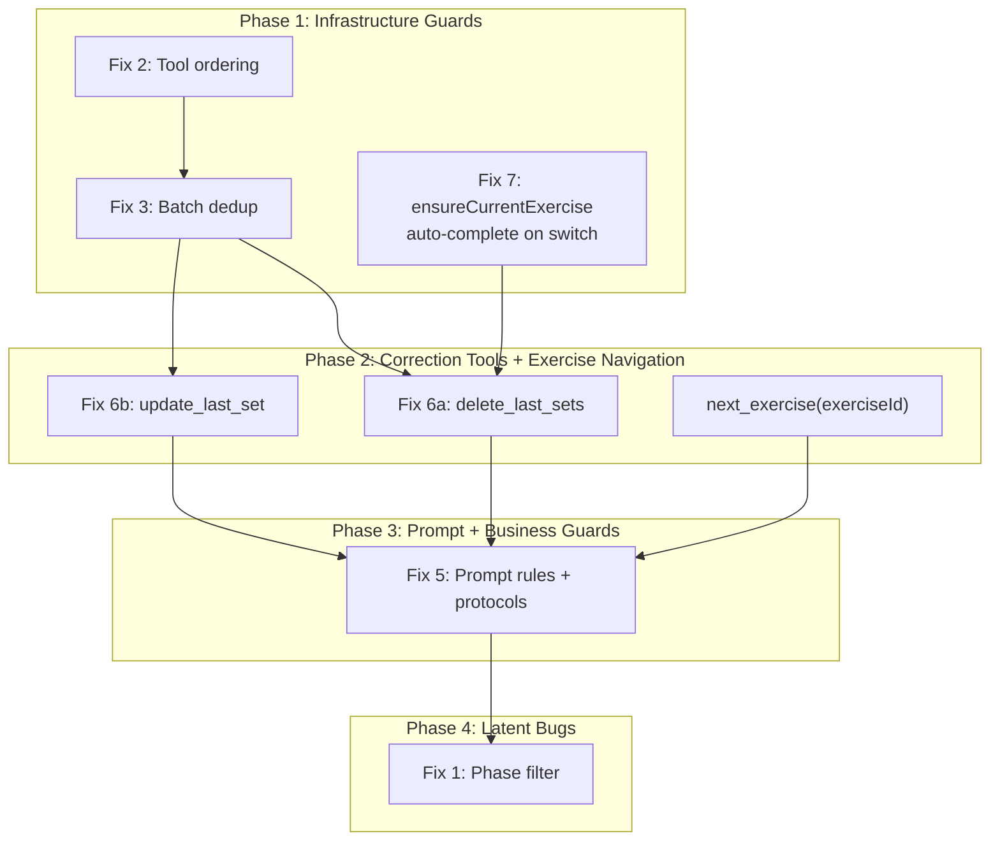
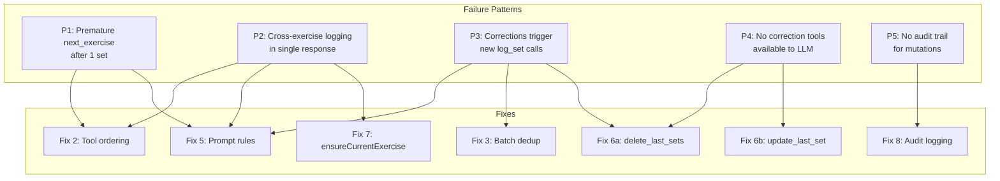

# Training Phase: Architectural Analysis & Fix Plan

## Versions: prod vs local

- `origin/main` (prod): commit `f291441`
- `origin/dev`: 1 commit ahead (docs only)
- Local `dev`: 6 commits ahead of main (5 unpushed)
- Delta in training-related files: **cosmetic refactoring only** (`prompt-directives`, client name in prompt). No training pipeline fixes between prod and local.
- **All bugs described below exist in both prod and local** — training subgraph code is identical.

## Incident Forensics — March 3rd (exact data from prod DB)

### Conversation timeline (key moments)

**Moment 1 — Tricep Pushdown: LLM jumped to next exercise after 1 set**

User: "32 - 12 reps, very easy" (this was the FIRST set)
LLM: logged as "Set 3", completed the exercise, moved to Lateral Raise
User: "that was the first set"
LLM: logged 2 more sets trying to "fix" (Sets 5-8 created)
User: "I haven't done the second set yet"
LLM: "sorry, now everything is correct"

**Moment 2 — Lateral Raise: LLM logged 1 set, closed exercise AND logged Bicep Curl — all in one response**

User: "on the lateral raise machine I did first set, 2.5 per side, 10 reps"
LLM in ONE response: logged Lateral Raise set 1 + COMPLETED Lateral Raise + logged Bicep Curl set 1
User: "I only did 1 set"
LLM: logged another set instead of understanding

**Moment 3 — Bicep Curl: total chaos with set counting**

User: "second set 14 reps at 20 kg"
LLM: "Set **5** saved" (instead of 2)
User: "I'm not done, there will be one more set"
LLM: logged "Set **6**" (no data from user!)
User: "sorry but I said two sets and you logged 6 instead of 2"
User: "no, the first was 15 kg and the second 20 kg"
LLM: logged "Set **7**" and "Set **8**" — even more duplicates

### Duplicate pattern by `session_sets.created_at` timestamps

```
Tricep Pushdown (target: 3 sets):
  Set 1: 04:05:17.364 — 32kg x12 ← real
  Set 2: 04:05:17.388 — 32kg x12 ← duplicate (gap 24ms, same LLM response)
  Set 3: 04:05:52.357 — 32kg x12 ← phantom (LLM "correcting")
  Set 4: 04:05:52.371 — 32kg x12 ← duplicate (gap 14ms)
  Set 5: 04:06:19.943 — 32kg x12 ← phantom (LLM "correcting" again)
  Set 6: 04:06:19.957 — 32kg x12 ← duplicate (gap 14ms)
  Set 7: 04:06:19.980 — 32kg x12 ← duplicate (gap 23ms)
  Set 8: 04:06:19.994 — 32kg x12 ← duplicate (gap 14ms)
  Set 9: 04:07:55.966 — 38kg x12 ← real
  Set10: 04:09:53.478 — 38kg x9  ← real

Dumbbell Bicep Curl (target: 3 sets):
  Set 1: 04:12:38.625 — 12kg x12 ← phantom (logged simultaneously with Lateral Raise set 1!)
  Set 2: 04:13:08.156 — 12kg x12 ← phantom
  Set 3: 04:21:18.828 — 12kg x12 ← phantom
  Set 4: 04:21:38.685 — 12kg x12 ← phantom
  Set 5: 04:23:39.229 — 20kg x14 ← real
  Set 6: 04:24:16.249 — 20kg x14 ← duplicate (LLM response to "I'm not done")
  Set 7: 04:25:51.601 — 15kg x10 ← real
  Set 8: 04:25:51.612 — 20kg x14 ← duplicate (gap 11ms, batch with set 7)
  Set 9: 04:27:40.028 — 20kg x10 ← real
```

Duplicates with gap < 100ms = single LLM response with multiple tool_calls.
Duplicates with gap 20-40s = LLM re-called log_set in the next turn due to user's corrective message.

## Failure Patterns

**P1. LLM prematurely calls `next_exercise`** — after 1 set when target=3. Current CRITICAL RULE "at least one set" is too weak.

**P2. LLM logs for different exercises in one response** — logs Lateral Raise, completes it, and immediately logs Bicep Curl. User never asked for this.

**P3. LLM interprets corrections as commands to log** — "that was the first set" triggers more log_set calls. "I only did 1" triggers more log_set calls.

**P4. LLM cannot correct mistakes** — no delete/update tool exists, so every "correction" attempt creates more phantom sets.

## Root Causes (by criticality)

### Cause 1: LLM generates multiple log_set calls in one response with identical data

LLM receives "32 - 12 reps very easy" and generates **2 log_set tool_calls** with identical arguments. `sequentialToolNode` executes both (gap ~24ms). Duplicate appears in DB.

**Why no protection:** `sequentialToolNode` does not check for duplicates. `logSetWithContext` does not check for duplicates. `setNumber = MAX+1` is atomic, but that is exactly what allows duplicates to accumulate.

**Level:** Infrastructure. Fix with guardrail in `sequentialToolNode`.

### Cause 2: LLM interprets corrective messages as logging commands

User: "that was the first set" (correction).
LLM sees CURRENT PROGRESS with already-logged sets, but instead of responding "understood, already recorded" — calls log_set again with data from CONVERSATION HISTORY.

**Why:** The prompt has a rule "Call log_set ONLY for sets explicitly reported in the user's current message", but LLM interprets "that was the first set" as an implicit set report referencing data from previous context.

**Why this is architectural, not just prompt-engineering:** LLM has no correction tool. The only action for "fixing" is to add another log_set. No `delete_set`, no `edit_set`. LLM is forced to "re-log correctly", creating even more duplicates.

**Level:** Missing correction tool + insufficient prompt rules.

### Cause 3: `getMessagesForPrompt` does not filter by phase

**File:** [drizzle-conversation-context.service.ts](apps/server/src/infra/conversation/drizzle-conversation-context.service.ts)

```typescript
.where(eq(conversationTurns.userId, userId))  // phase ignored!
```

In the March 3rd incident, all 44 recent messages were from the `training` phase, so this bug was NOT a direct cause. However, it is a **latent bug**: if the user had a long `chat`/`plan_creation` conversation before training, part of the 40-message window would be occupied by irrelevant history, displacing important training context.

**Level:** Latent, easy fix.

### Cause 4: Tool call ordering does not guarantee log_set before next_exercise

**File:** [training.subgraph.ts](apps/server/src/infra/ai/graph/subgraphs/training.subgraph.ts)

```typescript
const sorted = [...toolCalls].sort((a, b) => {
  if (a.name !== 'log_set' || b.name !== 'log_set') {
    return 0;  // next_exercise is not ordered
  }
  //...
});
```

If LLM calls `[next_exercise, log_set]`, `next_exercise` may execute first, switching the `in_progress` exercise. The following `log_set` lands on the wrong exercise (via `ensureCurrentExercise`).

Evidence: Bicep Curl set 1 created at 04:12:38.625, Lateral Raise set 1 at 04:12:38.591. Difference 34ms = same batch. LLM called `log_set` for two different exercises and `next_exercise` — order undefined.

**Level:** Infrastructure. Fix with sorting.

### Cause 5: No guard against excessive set count

`logSetWithContext` does not check `setNumber` against `targetSets`. Tricep Pushdown had target=3 but 10 sets were recorded without a single warning. LLM sees CURRENT PROGRESS with growing set count but lacks context that this is an anomaly.

**Level:** Missing business rule in service layer.

## Fix Plan (execution order)

### Phase 1: Infrastructure Guards (prevent worst damage)

#### Fix 2: Deterministic tool call ordering

**File:** [training.subgraph.ts](apps/server/src/infra/ai/graph/subgraphs/training.subgraph.ts)

Priority map: `log_set` (0) → `next_exercise`/`skip_exercise` (1) → `delete_last_sets`/`update_last_set` (2) → `finish_training` (3). Within `log_set` — sort by `order` field.

This is the foundation — until ordering is guaranteed, cross-exercise logging will keep happening. Fix 3 depends on this.

#### Fix 3: Pre-execution validation for duplicate log_set calls

**File:** [training.subgraph.ts](apps/server/src/infra/ai/graph/subgraphs/training.subgraph.ts)

In `sequentialToolNode`, before execution: check all `log_set` calls in the sorted list for exact argument equality. If any two calls have identical arguments (including `order` or lack thereof) — **reject ALL duplicate log_set calls** (do not execute any of them). Return `ToolMessage` with error:

`"Rejected: N identical log_set calls detected. If these are separate sets, each must have a unique order field (order=1, order=2, etc.). If this is one set, send a single log_set call."`

The LLM sees the error and retries in the next `agent → tools` cycle — either with a single call (it was a bug) or with proper `order` values (legitimate multiple sets).

Key difference from silent dedup: **zero incorrect records written to DB**. The LLM decides whether it was a bug or legitimate, not the server.

Validation applies **only within a single LLM response** (one batch of tool_calls). Between turns, identical sets are allowed (user may do multiple sets with the same weight).

**Audit log:** `log.warn({ userId, duplicateArgs, rejectedCount }, 'Identical log_set calls rejected — awaiting LLM correction')`

#### Fix 7: Transparent exercise switching in ensureCurrentExercise

**Files:** [training.service.ts](apps/server/src/domain/training/services/training.service.ts), [service.ports.ts](apps/server/src/domain/training/ports/service.ports.ts), [training.tools.ts](apps/server/src/infra/ai/graph/tools/training.tools.ts)

**Problem:** `ensureCurrentExercise` silently switches exercises without closing the current one. If LLM sends `log_set(exerciseId=39)` while `exerciseId=14` is `in_progress`, both end up `in_progress` — status leak. Neither LLM nor user see that a switch happened.

**Fix:** Auto-complete the current exercise on switch + return metadata:

1. At the start of `ensureCurrentExercise`, find the current `in_progress` exercise
2. If `exerciseId` matches → return as-is (no change)
3. If `exerciseId` is different:
   - If current exercise has sets > 0 → set status to `completed`
   - If current exercise has sets === 0 → set status to `skipped`
   - Populate `autoCompleted` metadata
4. If no `in_progress` exercise exists → proceed normally (first exercise)

**Return type change:**

```typescript
type EnsureExerciseResult = {
  exercise: SessionExercise;
  autoCompleted?: {
    exerciseId: number;
    exerciseName: string;
    setsLogged: number;
  };
};
```

**Propagation:** `logSetWithContext` returns `autoCompletedExercise` alongside `set` and `setNumber`. The tool handler in `training.tools.ts` prepends to the response:

`"Exercise 'Lateral Raise' auto-completed (4 sets). Set 1 logged for 'Bicep Curl': 10 reps @ 25 kg."`

If auto-completed with 0 sets: `"Exercise 'Lateral Raise' skipped (0 sets). ..."`

**Reopen support:** The existing code at line 163 already re-opens `completed`/`skipped` exercises when `log_set` targets them. With Fix 7, the *current* exercise is properly closed first. No separate `reopen_exercise` tool needed — covered by `log_set(exerciseId=X)` and `next_exercise(exerciseId=X)`.

**Audit log:** `log.info({ userId, sessionId, prevExerciseId, newExerciseId, setsLogged, newStatus }, 'Exercise auto-completed on switch')`

### Phase 2: Correction Tools (give LLM a way out of errors)

Must be implemented BEFORE Fix 5 (prompt), because the prompt references these tools.

#### Fix 6a: delete_last_sets tool (hard delete)

**Files:** [training.tools.ts](apps/server/src/infra/ai/graph/tools/training.tools.ts), [training.service.ts](apps/server/src/domain/training/services/training.service.ts), [session-set.repository.ts](apps/server/src/infra/db/repositories/session-set.repository.ts)

- `delete_last_sets(exerciseId, count?)` — physically deletes `count` most recent sets (by descending `set_number`) for the specified exercise
- `count` default=1, max=10 (safety cap)
- LLM does not specify setNumber — server finds MAX(set_number) and deletes top-down
- `exerciseId` is required — no risk of confusing exercises
- Validation: `exerciseId` belongs to current session, `count` <= actual set count
- Returns: `"Deleted 2 sets: #4 (10 reps @ 20kg), #3 (10 reps @ 20kg)"`
- New methods:
  - `TrainingService.deleteLastSets(sessionId, exerciseId, count)`
  - `SessionSetRepository.deleteById(setId)`

**Status after deleting ALL sets:** If all sets for an exercise are deleted, the exercise status is set to `in_progress` (not completed — there are no sets to justify completion). If the exercise is subsequently closed without any new sets (via `next_exercise` or `skip_exercise`), it becomes `skipped`.

**Audit log:** `log.info({ userId, sessionId, exerciseId, deletedSets: [...] }, 'Sets deleted by LLM correction')`

#### Fix 6b: update_last_set tool

**Files:** [training.tools.ts](apps/server/src/infra/ai/graph/tools/training.tools.ts), [training.service.ts](apps/server/src/domain/training/services/training.service.ts)

- `update_last_set(exerciseId, { rpe?, feedback?, weight?, reps? })` — updates the last set (MAX set_number) for the specified exercise
- `exerciseId` is required — explicit exercise binding
- LLM does not specify setNumber — server finds the last set
- Case: "last set was really hard" → `update_last_set(exerciseId, { rpe: 10, feedback: "barely finished" })`
- Case: "no, the weight was 15, not 12" → `update_last_set(exerciseId, { weight: 15 })`
- Returns: `"Set 2 updated: was [10 reps @ 12 kg, RPE —], now [10 reps @ 15 kg, RPE —]"`

**setData merge logic:** `weight` and `reps` live inside the jsonb `setData` column. `TrainingService.updateLastSet()` must read the existing `setData`, merge only the changed fields, and write the merged object back. Must NOT overwrite the entire `setData` — otherwise `update_last_set({ weight: 15 })` would lose the `reps` value. Implementation: `{ ...existingSetData, ...updates }` before calling `SessionSetRepository.update()`.

**Audit log:** `log.info({ userId, sessionId, exerciseId, before: {...}, after: {...} }, 'Set updated by LLM correction')`

#### next_exercise: add optional exerciseId parameter

**Files:** [training.tools.ts](apps/server/src/infra/ai/graph/tools/training.tools.ts), [training.service.ts](apps/server/src/domain/training/services/training.service.ts)

Current `next_exercise` has an empty schema (`z.object({})`) and always picks the first `pending` exercise via `startNextExercise`. There is no way to jump to a specific exercise.

**Change:** Add optional `exerciseId` parameter to the tool schema:

```typescript
schema: z.object({
  exerciseId: z.number().int().positive().optional()
    .describe('Target exercise ID to switch to. If omitted, moves to the next pending exercise in plan order.'),
})
```

If `exerciseId` is provided: complete the current exercise (as now), then find the specified exercise in the session and set it to `in_progress` (reopening it if it was previously `completed` or `skipped`). If not found in session, create it from the plan.

If `exerciseId` is omitted: current behavior (first `pending` exercise).

This enables the user to say "let's go back to Lateral Raise" without logging a set first, and gives LLM explicit control over exercise navigation.

### Phase 3: Prompt + Business Guards (teach LLM correct behavior)

#### Fix 5: Prompt rewrite — message classification + confirmation protocols

**File:** [training.node.ts](apps/server/src/infra/ai/graph/nodes/training.node.ts)

Add clear message classification and confirmation protocols:

```
=== MESSAGE CLASSIFICATION (apply before ANY action) ===

Before calling any tool, classify the user's message:
A) NEW SET REPORT — user reports completion of a set they just did NOW
   → If exercise name matches current in_progress exercise: call log_set
   → If exercise name does NOT match plan, is unclear, or user names an unknown exercise:
     ask ONE clarifying question before logging: "Hammer Strength Bicep Curl, 15 kg x 10 — first set, correct?"
     Do NOT log until the user confirms.
   → NEVER guess which exercise the user means. NEVER silently substitute one exercise for another.
B) CORRECTION — user says a previous confirmation was wrong ("that was my first set",
   "I only did one", "the weight was X not Y")
   → Do NOT call log_set. Acknowledge the discrepancy. Explain what is in CURRENT PROGRESS.
   If user wants to delete a wrong entry, use delete_last_sets.
   If user wants to fix data, use update_last_set.
C) QUESTION / CHAT — user asks a question, comments, or discusses
   → Do NOT call any tool. Respond conversationally.
D) EXERCISE TRANSITION — user says "done", "next", "moving on"
   → Call next_exercise (only if CURRENT PROGRESS shows sets >= targetSets for current exercise,
     OR user explicitly requests transition despite fewer sets)
E) SESSION END — user says "finished", "that's it for today"
   → Call finish_training

If classification is ambiguous, ask the user to clarify BEFORE calling any tool.

=== ONE EXERCISE AT A TIME ===
- NEVER log a set for an exercise that is not currently in_progress
- NEVER call next_exercise + log_set for the new exercise in the same response
- When transitioning: call next_exercise ONLY. Introduce the new exercise. Wait for user's first set report.

=== DELETION PROTOCOL ===
NEVER call delete_last_sets immediately upon user request.
1. Read CURRENT PROGRESS and identify the sets that would be deleted
2. List them to the user with FULL details from CURRENT PROGRESS:
   "I'll delete Set 3 (10 reps x 20 kg) and Set 4 (10 reps x 20 kg). Correct?"
3. Wait for explicit user confirmation
4. Only THEN call delete_last_sets with the correct exerciseId and count

=== UPDATE PROTOCOL ===
Before calling update_last_set, confirm the change:
   "I'll update Set 2: RPE → 10, comment → 'barely finished'. Correct?"
Wait for explicit confirmation, then call update_last_set.
```

#### ~~Fix 4: targetSets guard~~ REMOVED

Not needed. The LLM must simply be transparent — always report what was logged and show current progress. If the user disagrees, they will say so, and Fix 5 (message classification) + Fix 6a/6b (correction tools) handle it. The server should never second-guess the user's intent to do more sets than planned.

**Audit log:** `log.warn({ userId, exerciseId, setNumber, targetSets }, 'Set exceeds target count')`

### Phase 4: Latent Bugs

#### Fix 1: Phase filter in getMessagesForPrompt

**File:** [drizzle-conversation-context.service.ts](apps/server/src/infra/conversation/drizzle-conversation-context.service.ts)

Add `eq(conversationTurns.phase, phase)` to WHERE clause. Latent bug, simple fix.

**Compatibility note:** ADR-0010 (Conversation Thread Summarization) proposes replacing the flat sliding window with thread-based history. When ADR-0010 is implemented, raw messages will only come from the current thread, which naturally scopes by phase. This fix is a lightweight interim solution that does not conflict with ADR-0010.

### Cross-cutting: Audit Logging (Fix 8)

**Files:** [training.service.ts](apps/server/src/domain/training/services/training.service.ts), [training.subgraph.ts](apps/server/src/infra/ai/graph/subgraphs/training.subgraph.ts)

All mutating operations are logged via `createLogger('training')` at `info` level with full before/after data:

- `logSet` → `{ userId, sessionId, exerciseId, setNumber, setData }` — "Set logged"
- `deleteLastSets` → `{ userId, sessionId, exerciseId, deletedSets: [...] }` — "Sets deleted"
- `updateLastSet` → `{ userId, sessionId, exerciseId, before, after }` — "Set updated"
- `completeCurrentExercise` → `{ userId, sessionId, exerciseId }` — "Exercise completed"
- `skipCurrentExercise` → `{ userId, sessionId, exerciseId, reason }` — "Exercise skipped"
- dedup skip → `warn` level: `{ userId, duplicateKey, skippedCount }` — "Duplicate log_set calls skipped"

Format: structured JSON (pino ndjson), one line per event. Enables full mutation timeline reconstruction during incidents.

Audit logging is NOT a separate phase — it is woven INTO each fix. Every new service method includes logging from the start.

### Cross-cutting: Tests (Fix 9)

Unit tests for each fix, written alongside:

- `sequentialToolNode.test.ts`: dedup logic, ordering guarantee
- `drizzle-conversation-context.test.ts`: phase filtering
- `training.tools.test.ts`: delete_last_sets, update_last_set, next_exercise(exerciseId)
- `training-service.test.ts`: ensureCurrentExercise auto-complete, setData merge, delete-all-sets status transition
- Integration: reproduce scenario "user corrects a set"

## What We Do NOT Change

- `setNumber` in DB (atomic `MAX+1`) — correct implementation
- `sequentialToolNode` as a concept — correct, only improving it
- Graph/subgraph architecture — correct
- `TOOL EXECUTION RESULTS` mechanism — correct
- `buildToolResultsInjection` — correct
- `agentNode` general flow — correct (re-reads session from DB on every call)

## Execution Order Diagram



## Bug-to-Fix Mapping


