# FEAT-0006 Registration Conversation Flow (Diagram)

This diagram visualizes the conversational registration flow, reflecting FEAT-0006 scenarios and Domain rules.
Principle: steps are UX segmentation only; backend continuously extracts missing fields while profileStatus='registration' (or in explicit edit), and adapts the next prompt based on gaps. Confirmation is a derived phase (not a stored status): when all Stage 1 required fields are present, show summary and request confirmation; upon positive confirmation set profileStatus='active'.

```mermaid
flowchart TD
  %% Entry
  A[Incoming message] --> B{Valid API key?}
  B -- No --> B1[401/403]
  B -- Yes --> C{User exists?}
  C -- No --> C1[404 User not found]
  C -- Yes --> L{Explicit language change?}

  L -- Yes --> L1[Update user.languageCode] --> R
  L -- No --> M{Detected language ≠ languageCode?}
  M -- Yes --> M1[Ask switch confirmation 'Switch to lang?'] --> R
  M -- No --> R[Proceed]

  R --> S{profileStatus === 'active'?}
  S -- Yes --> N[Normal chat LLMService generateResponse]
  S -- No --> P[Parse message LLM ProfileParser]

  P --> Q{Ambiguous/unknown units?}
  Q -- Yes --> Q1[Ask short clarification] --> P
  Q -- No --> U[Persist captured fields Stage 1: goal, sex, dateOfBirth, height, weight, fitnessLevel, healthRestrictions, trainingLocation, equipmentPresent, availability]

  U --> T{All Stage 1 fields present?}
  T -- No --> T1[Ask only missing fields] --> Z[Helpful response]
  T -- Yes --> V[Show full profile summary Ask for confirmation] --> W{Confirm?}
  W -- Yes --> W1[Set profileStatus='onboarding'] --> O[Onboarding optional extended questions] --> Y{Completed or skip?}
  Y -- Yes --> A1[Set profileStatus='active']
  Y -- No  --> O
  W -- Edit --> W2[Go back to collect/clarify] --> P
  W -- No/unclear --> V

  %% Post-completion edit
  N --> E{Intent: Edit profile?}
  E -- Yes --> E1[Show current profile Propose updates] --> E2{Confirm changes?}
  E2 -- Yes --> E3[Persist changes] --> N
  E2 -- No --> N
  E -- No --> N

  %% Durability
  classDef note fill:#f7f7f7,stroke:#bbb,color:#333;
  D[(Persistence note: Data is saved incrementally resumes after restart)]:::note
  D -.-> U
```

Edit Flow (Active)

Legend
- Only missing fields are requested (BR-USER-008).
- Ambiguous inputs trigger a single clarification (BR-USER-009, BR-AI-005).
- Latest user-provided value overrides prior ones during registration (BR-USER-012).
- Transition to onboarding requires explicit confirmation of a full Stage 1 summary (BR-USER-011).
- Collection runs only while profileStatus='registration' or an explicit edit session is active (BR-USER-014/015).
- Language: explicit request switches immediately; auto-detected mismatch requires confirmation (BR-USER-006, BR-UX-001).
- Progress is durable across restarts (BR-USER-010).
- Activation: onboarding is optional; upon completion or explicit skip, set profileStatus='active'.
 - Edits while active: do not change profileStatus; show preview and persist only after explicit confirmation (BR-USER-015).
